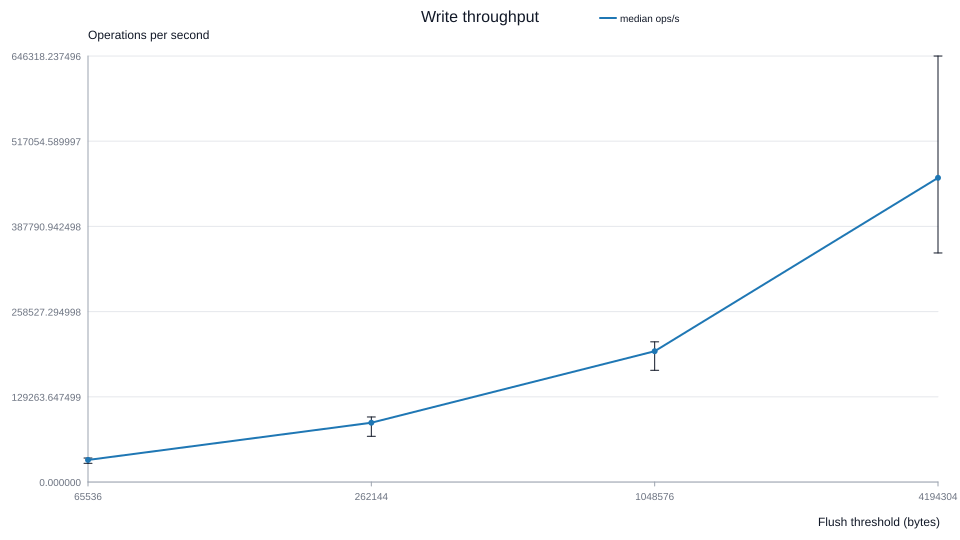
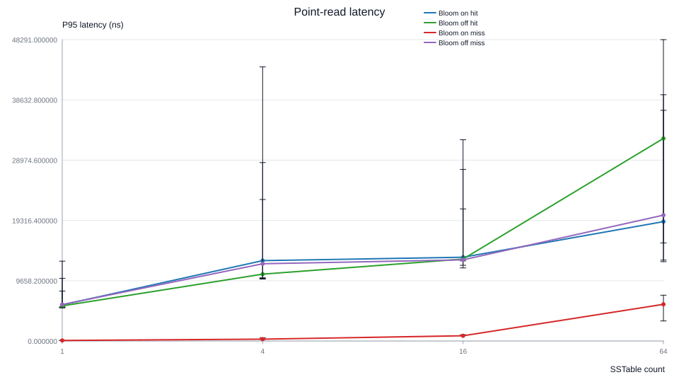
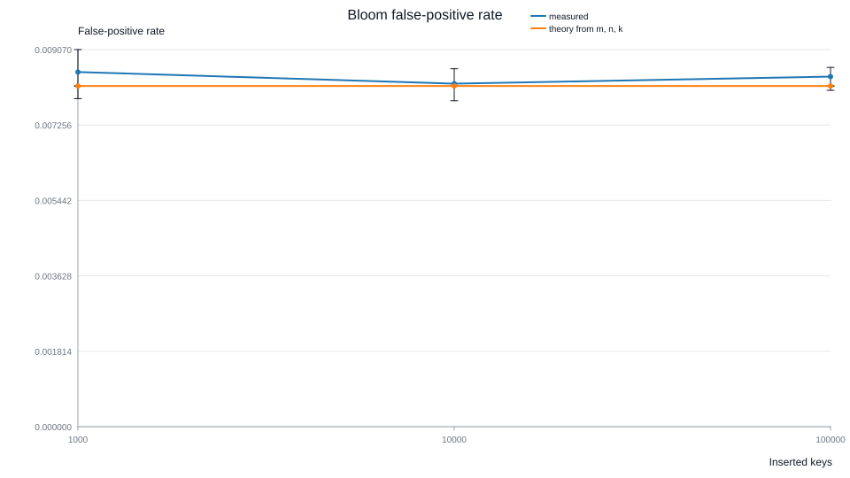
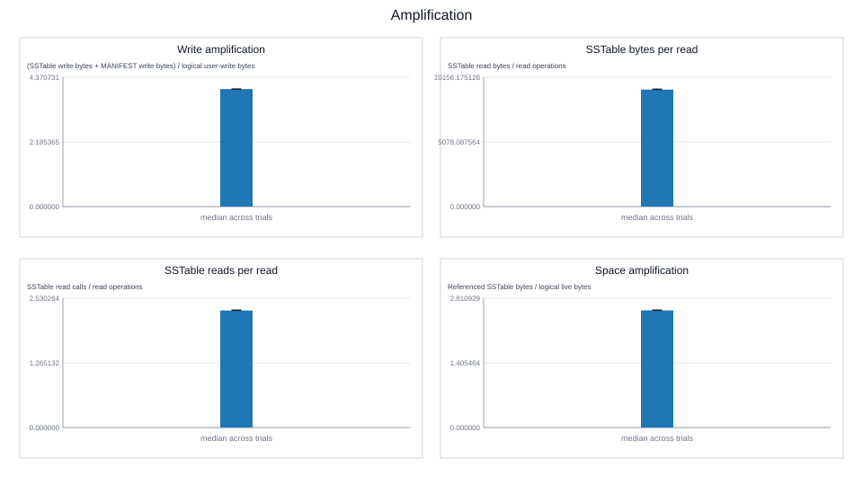
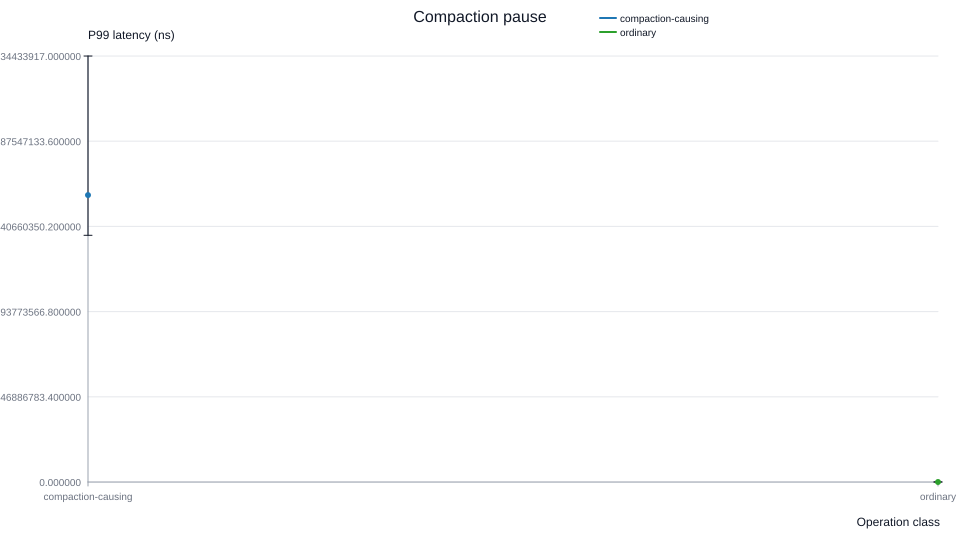
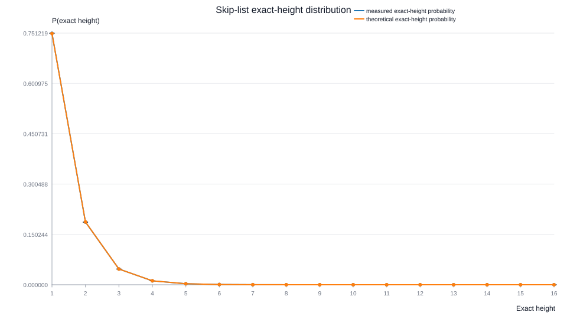

# MiniQuorum LSM benchmark report

## Scope and provenance

This report analyzes the persisted `report-v1` raw result in
[`bench/results/report-v1.json`](../bench/results/report-v1.json). The file
uses schema `miniquorum.lsm-benchmark`, schema version `1`, and the frozen
`report-v1` profile. Collection time is `2026-07-31T09:23:22Z`. The recorded
non-personal environment metadata is Go `go1.26.5`, `darwin`/`arm64`,
`num_cpu=8`, and `gomaxprocs=8`. Trials and seeds are paired as 1/1, 2/2,
3/3, 4/4, and 5/5.

The frozen workload matrix is:

- 16-byte keys and 128-byte values for every family.
- Write throughput: 100,000 PUTs at each flush threshold of 65,536,
  262,144, 1,048,576, and 4,194,304 bytes: four cells per trial.
- Point-read latency: SSTable counts 1, 4, 16, and 64; Bloom enabled and
  disabled; hit and miss lookups; 4,096 entries per SSTable and 25,000
  lookups per cell.
- Bloom false-positive behavior: 1,000, 10,000, and 100,000 inserted keys,
  with 100,000 absent probes per cell.
- Amplification: 250,000 operations over 25,000 keys, 90% PUT and 10% DELETE,
  65,536-byte flush threshold, then exactly 50,000 reads split 50/50 between
  hits and misses.
- Compaction pause: 100,000 PUTs over 100,000 keys at a 65,536-byte flush
  threshold.
- Skip-list height: 1,000,000 samples per trial.

The persisted row layout is 20 write-throughput rows, 80 point-read rows, 15
Bloom rows, 5 amplification rows, 5 compaction-pause rows, and 5 skip-list
rows, for exactly 130 rows. Collection records individual trials; the raw
individual trials are authoritative. Timings are host-specific and should
not be read as universal performance guarantees.

## Write throughput

Throughput is computed exactly as

`operations / elapsed_seconds = operations * 1e9 / elapsed_ns`.

The elapsed interval includes synchronous PUTs, automatic flush/compaction,
and the final `ForceFlush`. The table reports the median across five trials
and the minimum-to-maximum trial spread, in operations/second.

| Flush threshold | Median ops/s | Trial range |
|---:|---:|---:|
| 65,536 B | 33,469.46 | 28,350.66–36,349.33 |
| 262,144 B | 89,932.32 | 69,330.66–98,646.89 |
| 1,048,576 B | 198,428.84 | 169,479.63–212,621.12 |
| 4,194,304 B | 461,494.35 | 347,497.43–646,318.24 |

The measured median increases across these four thresholds. That is an
observation of this host and workload; the benchmark does not establish a
general causal explanation for the difference.

## Point-read latency

For each lookup cell, p50, p95, and p99 are nearest-rank quantiles of the
per-lookup elapsed times; max is the largest per-lookup time. The following
values are nanoseconds. Each entry is the median across five trial-level
quantiles, followed in brackets by that metric's minimum-to-maximum trial
range.

The required Bloom on/off point-read graph is shown here prominently:

| SSTables | Bloom | Lookup | p50 median [range] | p95 median [range] | p99 median [range] | max median [range] |
|---:|:---:|:---:|---:|---:|---:|---:|
| 1 | off | hit | 2,958 [2,708–3,334] | 5,625 [5,417–8,000] | 28,208 [17,375–37,708] | 258,625 [68,333–2,031,916] |
| 1 | off | miss | 3,041 [2,709–3,417] | 5,834 [5,292–12,792] | 23,500 [16,708–65,583] | 139,792 [71,042–4,789,666] |
| 1 | on | hit | 2,959 [2,792–3,333] | 5,792 [5,459–10,041] | 23,667 [20,125–41,542] | 113,125 [89,375–1,478,542] |
| 1 | on | miss | 42 [42–42] | 84 [84–84] | 166 [125–167] | 57,041 [32,375–67,833] |
| 4 | off | hit | 5,709 [5,666–7,000] | 10,709 [9,916–28,583] | 39,875 [33,666–101,792] | 475,125 [149,041–1,811,000] |
| 4 | off | miss | 5,875 [5,625–6,375] | 12,375 [10,042–22,666] | 43,292 [33,250–67,333] | 239,166 [157,875–3,046,625] |
| 4 | on | hit | 5,917 [5,791–7,959] | 12,875 [10,125–43,917] | 43,625 [33,250–209,542] | 590,708 [148,584–7,873,916] |
| 4 | on | miss | 167 [167–208] | 292 [250–500] | 2,834 [541–4,125] | 82,416 [48,750–826,792] |
| 16 | off | hit | 7,000 [6,583–7,292] | 13,125 [12,125–21,166] | 48,458 [43,750–58,167] | 544,250 [148,875–4,321,417] |
| 16 | off | miss | 6,875 [6,459–7,709] | 13,000 [11,708–27,500] | 47,750 [42,000–80,042] | 1,859,000 [138,000–2,989,375] |
| 16 | on | hit | 7,458 [7,334–8,458] | 13,417 [12,833–32,250] | 47,083 [42,458–96,541] | 415,625 [226,167–4,746,875] |
| 16 | on | miss | 625 [625–667] | 834 [833–1,000] | 4,292 [4,000–5,042] | 60,250 [38,333–2,977,917] |
| 64 | off | hit | 9,041 [7,584–9,334] | 32,459 [12,958–36,958] | 102,792 [44,208–138,291] | 1,530,916 [261,792–6,706,833] |
| 64 | off | miss | 8,500 [7,041–10,750] | 20,166 [12,708–39,459] | 58,250 [40,625–162,792] | 1,541,000 [249,167–4,917,084] |
| 64 | on | hit | 10,333 [9,750–11,792] | 19,125 [15,708–48,291] | 51,875 [47,542–136,500] | 2,047,292 [270,583–2,346,333] |
| 64 | on | miss | 2,792 [2,708–2,833] | 5,875 [3,209–7,333] | 10,417 [7,375–18,750] | 102,042 [75,583–1,793,250] |

In the measured cells, Bloom-enabled misses have much smaller median p50 and
p95 values than Bloom-disabled misses, while hit values remain in the same
general range at each SSTable count. These are measured comparisons, not a
claim that Bloom checks dominate every workload or host.

## Bloom behavior

For each row, measured false-positive rate is

`false_positives / probe_keys`.

The theoretical rate is computed from that row's actual values as

`(1 - exp(-k * inserted_keys / m_bits))^k`.

The configured construction is 10 bits/key and `k=7`; the persisted rows have
`m_bits` equal to 10 times their inserted-key count. The table reports the
median measured rate and trial range, with the common per-row theoretical
value and the largest measured/theoretical ratio in the three-key-size group.

| Inserted keys | Measured FP median [range] | Theoretical FP | Max measured/theory |
|---:|---:|---:|---:|
| 1,000 | 0.008530 [0.007890–0.009070] | 0.008193722 | 1.107 |
| 10,000 | 0.008250 [0.007840–0.008610] | 0.008193722 | 1.051 |
| 100,000 | 0.008420 [0.008090–0.008640] | 0.008193722 | 1.054 |

All 15 rows have `false_negatives == 0`. Independently recomputing every row
with `false_positives / probe_keys` and
`(1 - exp(-k*inserted_keys/m_bits))^k` gives a maximum measured/theoretical
ratio of 1.107, so every row satisfies the Phase 5 ceiling of at most twice
the configured/theoretical rate. No threshold, data, or harness claim was
weakened.

## Amplification

The raw metrics use these exact definitions:

- Write amplification =
  `(sstable_write_bytes + manifest_write_bytes) /
  logical_user_write_bytes`.
- Read bytes = `sstable_read_bytes / read_operations`.
- Read calls = `sstable_read_calls / read_operations`.
- Space amplification = `referenced_sstable_bytes / logical_live_bytes`.

Each value below is median [minimum–maximum] across the five trials.

| Metric | Median [trial range] |
|---|---:|
| Write amplification | 3.972453 [3.970877–3.973391] |
| SSTable read bytes/read | 9,187.463 [9,187.170–9,232.886] |
| SSTable read calls/read | 2.290080 [2.289040–2.300240] |
| Space amplification | 2.546049 [2.544590–2.555390] |

Every amplification trial contained 225,000 PUTs, 25,000 DELETEs, 32,800,000
logical user-write bytes, 50,000 reads, and 175 completed compactions. The
reported spread is trial spread, not a confidence interval.

## Compaction pause

An operation is classified as compaction-causing when its synchronous PUT is
followed by an observed increase in the engine's completed-compaction counter;
otherwise it is ordinary. The counter transition is checked outside the
measured PUT interval. This is a completed-work classification and does not
imply asynchronous compaction behavior.

The table reports nearest-rank quantiles in nanoseconds as median [trial
range] across five trials. Every trial classified 58 compaction operations and
99,942 ordinary operations.

| Quantile | Compaction-causing | Ordinary |
|---|---:|---:|
| p50 | 19,543,125 [18,639,125–22,935,125] | 292 [291–334] |
| p95 | 124,716,542 [87,793,458–144,665,083] | 625 [583–750] |
| p99 | 157,897,000 [135,775,208–234,433,917] | 1,000 [917–1,250] |
| max | 157,897,000 [135,775,208–234,433,917] | 35,856,375 [15,693,792–49,978,042] |

The observed tail separation is specific to the synchronous operation classes
and this host. It is not evidence for a different execution model.

## Skip-list height

Measured exact-height probability is `height_count / samples`. With promotion
probability `p=1/4`, the theory is

`(3/4) * (1/4)^(h-1)` for heights 1 through 15, and `(1/4)^15` for the
truncated height 16. The table reports median [trial range] from five
1,000,000-sample rows.

| Height | Measured probability median [range] | Theory |
|---:|---:|---:|
| 1 | 0.750616 [0.750023–0.751219] | 0.750000 |
| 2 | 0.187180 [0.186230–0.187346] | 0.187500 |
| 3 | 0.046908 [0.046448–0.047275] | 0.046875 |
| 4 | 0.011605 [0.011513–0.011798] | 0.011718750 |
| 5 | 0.002906 [0.002895–0.002933] | 0.002929688 |
| 6 | 0.000716 [0.000699–0.000770] | 0.000732422 |
| 7 | 0.000191 [0.000165–0.000196] | 0.000183105 |
| 8 | 0.000042 [0.000034–0.000059] | 0.000045776 |
| 9 | 0.000012 [0.000008–0.000015] | 0.000011444 |
| 10 | 0.000003 [0.000002–0.000005] | 0.000002861 |
| 11 | 0.000001 [0.000000–0.000002] | 0.000000715 |
| 12 | 0 [0–0] | 0.000000179 |
| 13 | 0 [0–0] | 0.000000045 |
| 14 | 0 [0–0] | 0.000000011 |
| 15 | 0 [0–0] | 0.000000003 |
| 16 | 0 [0–0] | 0.000000001 |

The measured expected height per trial had median 1.332604 and range
1.331605–1.333274. The truncated geometric expectation is
`(1 - (1/4)^16) / (1 - 1/4) = 1.333333333`.

## Limitations

These measurements describe one host, one Go/runtime environment, the frozen
workloads, and five paired trial seeds. Trial ranges expose observed spread;
they are not statistical confidence intervals. Filesystem behavior, scheduler
load, CPU frequency, storage, runtime version, and workload shape can change
the results. The report does not isolate causal mechanisms, extrapolate to
other machines, or make universal performance claims. Raw individual trials
remain the authoritative evidence.
